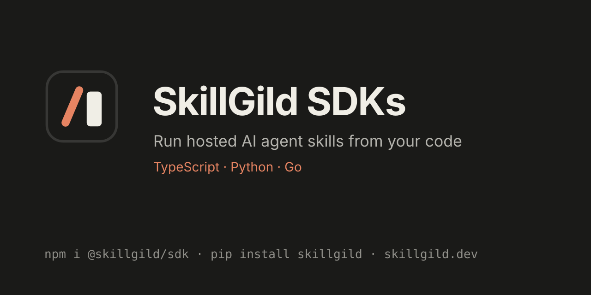

<p align="center">
  <a href="https://skillgild.dev/?utm_source=github&utm_medium=referral&utm_campaign=sdks">
    
  </a>
</p>

<p align="center">
  <a href="https://www.npmjs.com/package/@skillgild/sdk"></a>
  <a href="https://pypi.org/project/skillgild/"></a>
  <a href="https://pkg.go.dev/github.com/skillgild/sdks/go/skillgild"></a>
  <a href="https://github.com/SkillGild/sdks/actions/workflows/ci.yml"></a>
  <a href="LICENSE"></a>
  <a href="https://m8ven.ai/mcp/skillgild-sdks-1jl6xu?s=readme"></a>
</p>

# SkillGild SDKs for TypeScript, Python and Go

Official client libraries for **[SkillGild](https://skillgild.dev/?utm_source=github&utm_medium=referral&utm_campaign=sdks)**, the marketplace for hosted **AI agent skills**. Use them to search the skill catalog, run hosted skills and drive hybrid tool sessions from your own app, agent or backend, the same skills that work in Claude Code, Codex, Cursor, Gemini CLI and any MCP client.

| Language | Package | Folder |
| --- | --- | --- |
| TypeScript / JavaScript | [`@skillgild/sdk`](https://www.npmjs.com/package/@skillgild/sdk) | [`typescript/`](typescript) |
| Python | [`skillgild`](https://pypi.org/project/skillgild/) | [`python/`](python) |
| Go | [`github.com/skillgild/sdks/go`](https://pkg.go.dev/github.com/skillgild/sdks/go/skillgild) | [`go/`](go) |

## Install

```sh
npm install @skillgild/sdk              # TypeScript / JavaScript (Node 20+, Bun, Deno, browsers)
pip install skillgild                   # Python 3.9+
go get github.com/skillgild/sdks/go     # Go 1.22+
```

Create an API key in your [SkillGild account](https://skillgild.dev/account?utm_source=github&utm_medium=referral&utm_campaign=sdks) and export it as `SKILLGILD_API_KEY`. Browsing the catalog needs no key.

## Quick start

Most SkillGild skills are **hybrid**: your agent follows the skill's guide and calls SkillGild server tools during a session. This example opens a session for [Logo Design](https://skillgild.dev/skills/logo-design?utm_source=github&utm_medium=referral&utm_campaign=sdks) and calls its `validate_svg` tool.

**TypeScript**

```ts
import { SkillGildClient } from "@skillgild/sdk";

const client = new SkillGildClient({ apiKey: process.env.SKILLGILD_API_KEY });

const session = await client.startSession("logo-design");
console.log(session.guide);                       // instructions for your agent
const check = await client.callTool(session.session_id, "validate_svg", {
  svg: '<svg xmlns="http://www.w3.org/2000/svg" viewBox="0 0 100 100"><circle cx="50" cy="50" r="40"/></svg>',
});
console.log(check.result);
await client.endSession(session.session_id);
```

**Python**

```python
import os
from skillgild import SkillGildClient

client = SkillGildClient(api_key=os.environ["SKILLGILD_API_KEY"])

session = client.start_session("logo-design")
check = client.call_tool(session["session_id"], "validate_svg", {"svg": "<svg xmlns='http://www.w3.org/2000/svg' viewBox='0 0 10 10'/>"})
print(check["result"])
client.end_session(session["session_id"])
```

**Go**

```go
client, err := skillgild.NewClient("", skillgild.WithAPIKey(os.Getenv("SKILLGILD_API_KEY")))
if err != nil { return err }
session, err := client.StartSession(ctx, "logo-design")
if err != nil { return err }
defer client.EndSession(ctx, session.SessionID)
check, err := client.CallTool(ctx, session.SessionID, "validate_svg", map[string]any{"svg": svg})
```

Hosted (`prompt_pipeline`) skills run in one call with `runSkill` / `run_skill` / `RunSkill`, and accept an idempotency key so retries are safe.

## What the SDKs cover

| Area | Methods |
| --- | --- |
| Catalog (no key) | list and search skills, skill detail with media and page copy, categories, tags, collections, featured skills |
| Hosted runs | run a skill with an optional idempotency key |
| Hybrid sessions | start or resume a session, call server tools, end the session |
| Account | current account, revoke the current API key, device login |
| Errors | HTTP status, API error code, message and `Retry-After` delay |

The full endpoint reference, limits and error codes are in the **[SkillGild API documentation](https://skillgild.dev/docs/api?utm_source=github&utm_medium=referral&utm_campaign=sdks)**. New to SkillGild? Start with the [developer quickstart](https://skillgild.dev/docs/quickstart-developers?utm_source=github&utm_medium=referral&utm_campaign=sdks).

## Find skills to run

Browse the [skill catalog](https://skillgild.dev/skills?utm_source=github&utm_medium=referral&utm_campaign=sdks) or a category:
[Design](https://skillgild.dev/categories/design?utm_source=github&utm_medium=referral&utm_campaign=sdks) ·
[Video & Media](https://skillgild.dev/categories/video-media?utm_source=github&utm_medium=referral&utm_campaign=sdks) ·
[Research](https://skillgild.dev/categories/research?utm_source=github&utm_medium=referral&utm_campaign=sdks) ·
[Development](https://skillgild.dev/categories/development?utm_source=github&utm_medium=referral&utm_campaign=sdks) ·
[Content Creation](https://skillgild.dev/categories/content-creation?utm_source=github&utm_medium=referral&utm_campaign=sdks)

A few to try: [Academic Plotting](https://skillgild.dev/skills/academic-plotting?utm_source=github&utm_medium=referral&utm_campaign=sdks) for publication-ready figures, [Taste Skill](https://skillgild.dev/skills/design-taste-frontend?utm_source=github&utm_medium=referral&utm_campaign=sdks) for frontend design, [HyperFrames](https://skillgild.dev/skills/hyperframes-core?utm_source=github&utm_medium=referral&utm_campaign=sdks) for programmatic video and [OpenSpec Propose](https://skillgild.dev/skills/openspec-propose?utm_source=github&utm_medium=referral&utm_campaign=sdks) for spec-driven development.

Prefer a terminal or an MCP client? The [SkillGild CLI and MCP server](https://skillgild.dev/docs/api?utm_source=github&utm_medium=referral&utm_campaign=sdks#cli-and-mcp-reference) wrap the same API.

## Privacy and security

The SDKs are thin REST clients. They contain no skill prompts or implementations; authentication, entitlements, quotas and execution are enforced by the SkillGild API. Run inputs are sent to SkillGild and, for hosted skills, to the configured model provider, so do not send secrets or project content without the user's approval. Hybrid tool input is processed by SkillGild code only and is not stored.

Report vulnerabilities as described in [SECURITY.md](SECURITY.md).

## Contributing and releases

Issues and pull requests are welcome. Each SDK has its own tests (`npm test`, `python -m unittest discover -s tests`, `go test ./...`) and CI runs all three. Releases are tag-driven; see [RELEASING.md](RELEASING.md).

## License

[MIT](LICENSE) © SkillGild, Inc. · [skillgild.dev](https://skillgild.dev/?utm_source=github&utm_medium=referral&utm_campaign=sdks)
